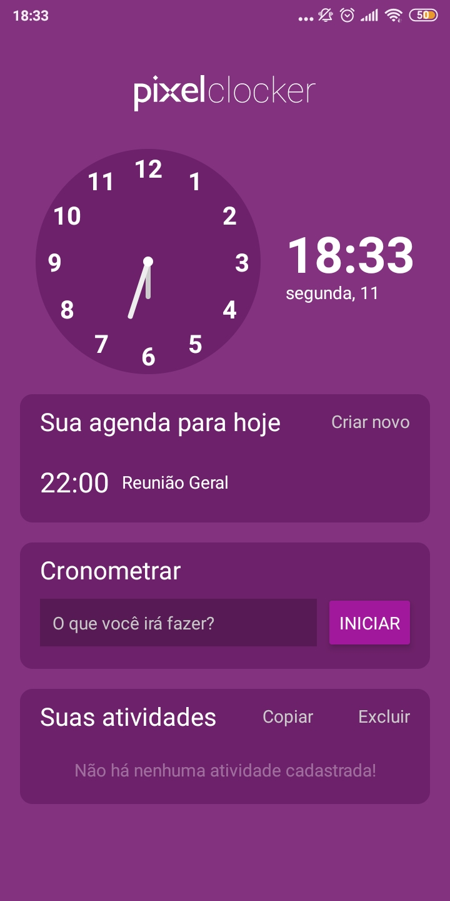

PixelClocker é um aplicativo simples desenvolvido para trilha avançada do processo trainee 2020.1 da Pixel, empresa júnior de Sistemas de Informação e Ciências da Computação da UFSC.

## Demonstração

## Características

### Desenvolvido principalmente com
* React Native 
* Expo v37
* React Navigation v5
* Redux
* Redux persist
* Styled-components
### Principais conceitos necessários para o desenvolvimento

* Storage global da aplicação com Redux;
* Persistência de dados da aplicação com Redux Persist;
* Desenvolvimento de componentes com styled-components;
* Criação de rotas para o aplicativo (nesse caso foi utilizado o roteador Stack);

## Download

Para baixar o aplicativo final do projeto, [clique aqui](https://exp-shell-app-assets.s3.us-west-1.amazonaws.com/android/@higorpo/PixelClocker-443f3c24e24c45ee8feb67114b40363d-signed.apk).
